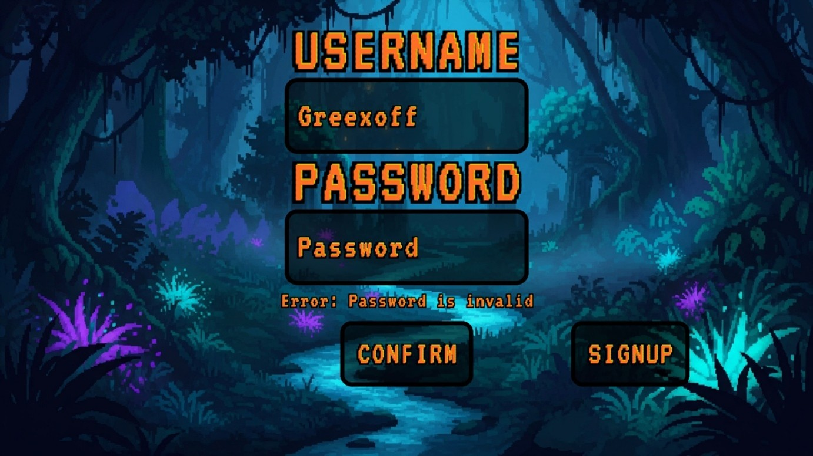
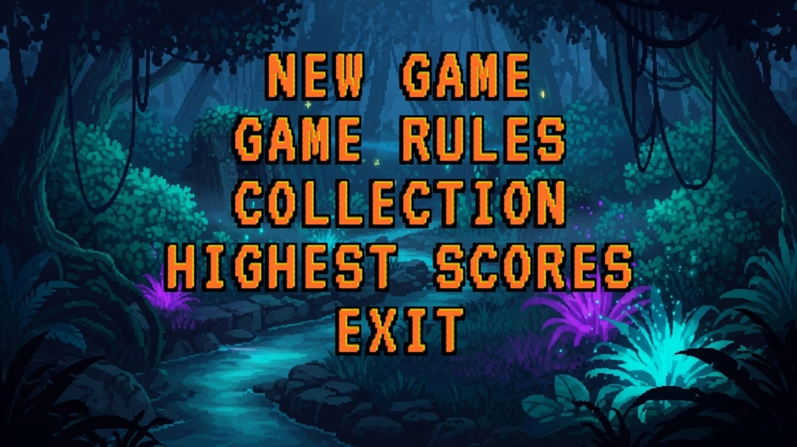
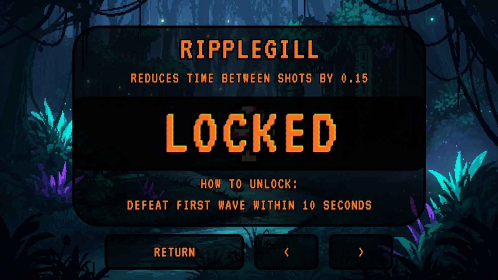
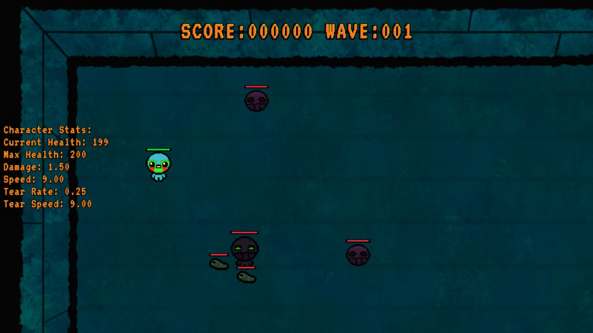
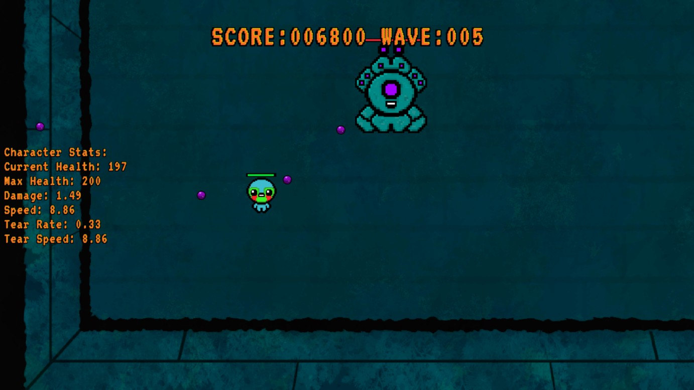
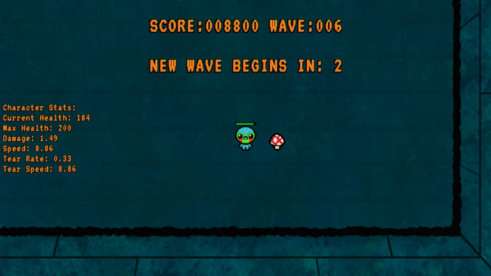

# Blightwood Abyss - Survival Game

## Overview
Blightwood Abyss is 2D Survival Mode game where the player faces endless waves of enemies in a closed arena. The project focuses on high replayablility through a system of random loot, character progression, and unlockable items. The player's main objective is to survive as long as possible and achieve highest possible score.

---

## Technology Stack
* **Language:** C++20
* **Graphics Library:** Raylib
* **Development Environment:** Visual Studio

---

## Core Features
* **Wave System:** Survival against increasingly numerous waves of monsters.
* **Tears Combat System:** Player eliminate enemies by shooting projectiles called tears.
* **Boss Fights:** Every 5th wave, player face one of two bosses with high health and unique attack patterns.
* **Loot & Progression:** Defeated enemies have chance to drop either Hearts that restore health to player, or Stones that randomly buff or debuff player's stats.
* **Character Selection:** 3 playable heroes, each with different base attributes.
* **Unlockables:** Certain items are locked by default and require specific achievements to be usable in-game.
* **Game Rules & Bestiary:** An in-game menu to view game rules and stats of all monsters, characters and items.
* **User Accounts & Highest Scores** A built-in login and registration system that saves user progress and presonal best scores. Scores of individual players can be seen in specific tab.

---

## Gameplay & Visuals
* **User Registration:** The build-in system allows players to create local accounts or sign in to already existing account. 
* **Main Menu:** The central navigation hub providing access to the core game, rules, collection and the highest score leaderboards. 
* **Game Rules & Bestiary:** A guide that explains core mechanics and provides detailed stats for every monster, character and item. 
* **Collection:** A dedicated menu for tracking unlocked items, including specific hints on how to obtain currently locked content. 
* **Gameplay Loop:** Core gameplay loop with basic wave of enemies. 
* **Boss Fight:** Special fight with powerful bosses with unique abilities. 
* **Dropped Loot:** Randomized items that drop after defeating enemies. 

*\*Background assets were generated using AI tools, while character and entity models are custom-edited sprites based on original assets from The Binding of Issac.*

---

## Documentation

Full technical documentation is available in Polish and provides an in-depth look at the project's engineering process. Documentation includes:
* **Project Specification:** Detailed game design goals, requirements, and technology overview.
* **UML Diagrams:** Class diagrams, activity diagrams illustrating the program's structure.
* **Method Documentation:** A breakdown of important methods and fields for every class in the project.

[Full documentation (PDF)](Documentation/BlightwoodAbyss_Documentation.pdf)
